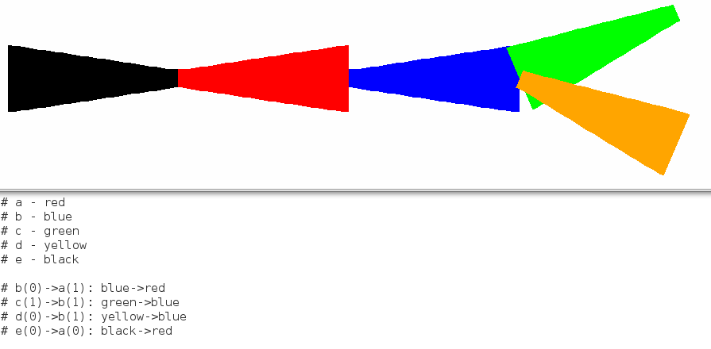

# neuron_gui2
Jupyter Notebook which shows the new capabilities of GUI2 for NEURON. Downloaded from https://neuron.yale.edu/ftp/ramcdougal/ball-and-stick-1.ipynb

run ball-and-stick-1.ipynb for GUI2 examples

